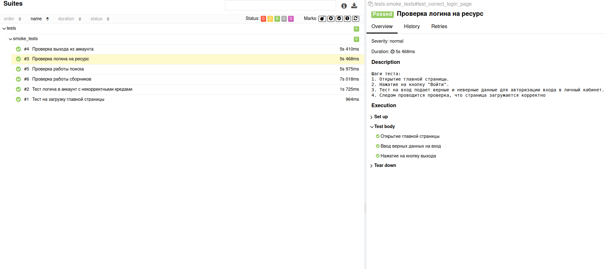

# test_task
Техническое задание 
=======
Необходимо создать набор (5-7) автоматизированных тестов для тестирования веб-сайта.

### Требования:
- Язык программирования: любой (лучше Python)
- Используйте фреймворк для тестирования, например, PyTest, TestNG и прочее.
- Используйте Selenium или Selenide для взаимодействия с веб-страницей.
- Весь код должен быть хорошо структурирован и легко читаемый.

### Задание:
- Перейдите на главную страницу сайта https://www.example.com  (любой сайт).
- Проверьте, что главная страница отображается корректно.
- Найдите и кликните на ссылку "Вход", чтобы перейти на страницу входа.
- На странице входа введите некорректные данные (например, "test" для имени пользователя и "test" для пароля) и нажмите кнопку входа.
- Проверьте, что отображается сообщение об ошибке, указывающее на то, что введены неправильные данные для входа.
-Введите корректные данные для входа и нажмите кнопку входа.
- Проверьте, что вы успешно вошли в систему и были перенаправлены на главную страницу.
- Найдите и кликните на ссылку "Выход", чтобы выйти из системы.
- Проверьте, что вы успешно вышли из системы и были перенаправлены на главную страницу.
- Опишите документацию для тестов, включая все предположения и ограничения, которые были сделаны в процессе создания тестов.

### Необходимо предоставить:
- Исходный код тестов.
- Инструкцию по установке и запуску тестов.
- Отчёт о результатах тестирования.
- Документацию тестов.

### Пошаговое описание тестов

1. Переход на главную страницу [zaycev.net](https://zaycev.net/).
2. Убедиться, что главная страница открылась.
3. На главной странице найдите и щелкните на элемент "Вход", чтобы перейти на страницу входа в личный кабинет.
4. На странице входа в личный кабинет введите неверные данные, например, "test" для поля логина и "test" для поля пароля, затем нажмите кнопку входа.
5. Проверьте, что отображается сообщение об ошибке, указывающее на то, что введены неверные данные для входа в личный аккаунт.
6. Введите верные данные для входа в личный кабинет, затем нажмите кнопку входа.
7. Проверьте, что успешно вошли в личный кабинет и были перенаправлены на главную страницу.
8. Найдите кнопку "Выход" на странице личного кабинета и нажмите ее, чтобы выйти из аккаунта.
9. Проверьте, что успешно вышли из личного кабинета и были перенаправлены на главную страницу сайта.


### Пошаговое описание по запуску теста 
1. Установите Python с официального сайта (https://www.python.org/). Следуйте инструкциям на сайте для вашей операционной системы.  
2. Откройте терминал и выполните следующую команду: python3 -m venv venv. Это создаст виртуальное окружение с именем "venv"
3. Активируйте виртуальное окружение. Для этого выполните команду:
   - На Windows: venv\Scripts\activate
   - На macOS и Linux: source venv/bin/activate
4. Если не установлен allure, необходимо поставить, под Linux так
   ```bash
      sudo apt-get install default-jre &&
      wget https://github.com/allure-framework/allure2/releases/download/2.18.1/allure_2.18.1-1_all.deb &&
      sudo dpkg -i allure_2.18.1-1_all.deb
   ```
5. Установите зависимости, указанные в файле "requirements.txt", в виртуальное окружение. Для этого выполните команду pip install -r requirements.txt.
6. Перейдите в папку с репозиторием проекта (если еще не перешли) и выполните следующую команду: pytest tests/smoke_tests.py --alluredir=allure. Эта команда запустит тесты из файла "smoke_tests.py" и создаст отчет в папке "allure".
7. Если сервер не стартанул автоматически, можно поднять руками. Вот так: allure serve allure/. Отчет будет доступен в вашем браузере по адресу http://localhost:port, где "port" - это порт, указанный в выводе команды.
8. Откройте отчет о прогоне тестов и изучите результаты. Вы сможете видеть информацию о пройденных и не пройденных тестах, логи, скриншоты и другую полезную информацию.

### Отчет выглядит так:

>>>>>>> 910b1af (add filed)
